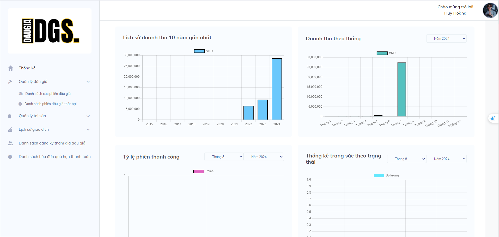

# ⚖️ Jewelry Auction System - Capstone Project SWP391 - FPT University HCM - SUMMER 2024

&nbsp;

## 🌟🌟🌟
- [About](#beginner-about)
- [Key Features](#memo-key-features)
- [Technology](#wrench-technology)
- [LiveDemo](#link-demo)
- [Contributors](#ok_man-contributors)
- [License](#key-license)

---

## :beginner: About

 - 💸 This web app is out capstone project of semester 5 in FPT University 📘📙📗
 - 💸 The online jewelry auction web app allows users to participate in auctions for unique jewelry items. Users can register, view a list of items up for auction, place bids, and follow auctions in real-time. Additionally, users can submit their own jewelry for auction on the platform.

---

## :memo: Key Features

**1. Registration and Login:** 
- Users can create an account using their email and password.
- Security with JWT (JSON Web Tokens) for authentication and bcrypt for password encryption.
  
&nbsp;
&nbsp;
 

**2. Jewelry Listings** 
- Display of jewelry items currently up for auction, including images, detailed descriptions, starting bids, and auction end times.
- Search and filter features for jewelry type, price, date and auction status (ongoing, waiting, finished).
  
&nbsp;
&nbsp;
&nbsp;
&nbsp;
 

**3. Bidding:** 
- Users can place bids on their registered auction with favorite jewelry items.
- The system automatically updates the highest bid and notifies users of changes in bidding.
Support for real-time bidding with auto-refresh functionality.
  
&nbsp;
&nbsp;
&nbsp;
&nbsp;
 

**4. Submit Jewelry for Auction:** 
- Users can register to submit their jewelry items for auction.
- Functionality to upload images, provide detailed descriptions, set buy now price,...
- Staff, admin approval process to ensure the quality and authenticity of submitted jewelry.
- Sellers can track the progress of the jewelry in their profile.
  
&nbsp;
&nbsp;
&nbsp;
&nbsp;
 

**5. Notifications:** 
- Notifications in-app alerts when a higher bid is placed or when an auction is nearing its end.
- Notifications via email when active new account, process of jewelry.
- Alerts for important activities such as change status jewelry, register auction success or password changes.
  
&nbsp;
&nbsp;
 

**6. Account Management:** 
- Users can manage their personal information, auction history, and jewelries items.
- Admin dashboard to add, verify, edit, and delete accounts.
  
&nbsp;
&nbsp;
 

**7. Dashboard:** 
- Manager dashboard to edit, and delete jewelries, manage submit jewelries from sellers, manage transactions, manage auctions.
- Admin dashboard to to add, verify, edit, and delete accounts.
  
&nbsp;
&nbsp;
&nbsp;
&nbsp;
&nbsp;
&nbsp;
 
 

---

## :wrench: Technology

**1. Frontend:**  
- React.js with TypeScript, i18next for internationalization, Ckeditor for rich text editing in descriptions, Firebase for storing images and UI libraries like React-Bootstrap, SweetAlert for user-friendly alert dialogs.  
&nbsp;&nbsp;&nbsp;&nbsp;

**2. Backend**
- Spring Boot with Hibernate for building the API, SQL Server for data storage.  
&nbsp;&nbsp;&nbsp;

**3. Realtime**
- Socket.io, Websocket for real-time bidding functionality.  

**4. Security**
- JWT for authentication and bcrypt for password encryption.  

**5. Deployment**
- Use Vercel and Railway for deployment.  
&nbsp;&nbsp;

## :link: Demo
🌐 <a href="https://website-auction-production.vercel.app/" target="_blank">Jewelry Auction Web</a>

## :ok_man: Contributors

---

## :key: License
© 2024 Licensed under the <a href="https://github.com/huyhoang-doit/AuctionWebApp_FE/blob/master/LICENSE" target="_blank">MIT License</a>

> 💁 Feel free to use my repository and star it if you find something interesting 🤘